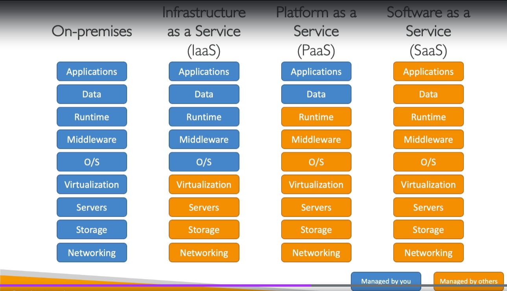

# 클라우드 개념

## 웹사이트 원리
> -  호스팅된 서버와 웹 브라우저에서 서버로 액세스해서 웹사이트를 시각화함
> - 이 때 클라이언트에서는 네트워크를 사용함

### 네트워크란? 
네트워크는 클라이언트와 서버 사이에 있고 클라이언트가 네트워크를 찾아 패킷을 라우팅하기 위해 네트워크를 사용해 데이터를 서버에 보내면 서버가 클라이언트에 응답하고 응답을 얻으면 웹사이트를 볼 수 있다.

- 네트워크 : 서로 연결될 케이블과 라우터, 서버의 묶음
- 패킷 : pack + bucket -> 정보를 보낼 때 특정 형태를 맞추어 보낸다는 뜻컴퓨터 간 데이터 주고받을 때 네트워크를 통해서 전송되는 데이터 조각
- 라우터 : 컴퓨터 네트워크 간의 데이터 패킷을 전달하는 특정 기기 인터넷에서 패킷을 어디로 보낼지 파악함
- 스위치 : 스위치는 패킷을 네트워크의 정확한 클라이언트에 보냄

클라이언트와 서버가 서로를 찾으려면 IP 주소가 있어야함

### 기존의 서버

컴퓨팅 : CPU는 몇 가지 계산을 실행하는 작은 조각으로 계산하고 결과 찾는데 유용함

메모리(RAM) : 메모리는 아주 빠른 메모리가 필요하고 정보를 저장하고 빨리 검색할 수 있도록함

데이터 베이스 : 데이터를 저장하려고 DB를 사용하고 DB는 데이터를 쉽게 검색하고 쿼리가 가능한 형식의 데이터가 될 것

네트워크 측면 : 라우터, 스위치, DNS 서버

서버 – 컴퓨팅, 메모리, 스토리지 측면이 있고 DB일 수도 있고, 네트워킹 측면이 있음

**클라우드에서는 이것을 온 디맨드로 제공함**

### 클라우드 서버

**클라우드 컴퓨팅** : 컴퓨팅 성능과 데이터베이스 스토리지, 애플리케이션과 다른 IT 리소스를 온디맨드 형식으로 제공하는 것
- 온디맨드 : 필요할 때 얻는 것

그래서 필요한 컴퓨팅 리소스의 정확한 유형과 크기를 프로비저닝할 수 있음
큰 서버가 필요하면 큰 서버를, 10개 서버가 필요하면 10개 서버를 바로 사용할 수 있음

모든 리소스에 액세스할 수 있음

클라우드는 훌륭한 인터페이스를 제공해 서버, 스토리지, DB 그리고 일련 앱 서비스에 쉽게 액세스 가능

이제 사무실, 차고 혹은 own 데이터센터 대신 클라우드를 사용할 수 있음

## 클라우드 종류
### 사설 클라우드
Rackspace : 단일조직에서 사용하는 클라우드 서비스

외부에 노출되지 않아서 자체 사설 클라우드와 자체 사설 데이터 센터를 가지며 다른 사람이 관리하지만, 여러분이 완전히 제어할 숭 lT고, 특정 사업에서 요구되는 민감한 앱을 위해 강화된 보안이 제공

### 공용 클라우드
3군데 정도 MS Azure, Google Cloud, AWS

타사 클라우드 서비스 제공업체가 클라우드 리소스를 소유하고 운영하고 인터넷을 제공함

### 하이브리드 클라우드
사설, 공용 클라우드를 결합한 것

일부 서버를 온프로미스에 유지하고 필요한 기능의 일부를 클라우드로 확장함

자체 인프라 + AWS 클라우드의 하이브리드

사설 클라우드에 있는 민감 정보 제어, 공용 클라우드를 사용해 유연함과 비용 효율성 가짐

## 클라우드 컴퓨팅의 5가지 특징
1. 완전한 온디맨드, 셀프서비스

2. 광역 네트워크에 액세스할 수 있음
   - 다양한 방법으로 리소스에 액세스 가능
   - 
3. 멀티 테넨시가 될 것이며 리소스 풀링이 가능함
    - AWS의 다른 고객도 동일한 인프라와 앱을 공유하면서 보안과 프라이버시 유지 가능
    - 많은 고객은 동일한 물리적 리소스로 서비스 받게 됨 즉, 클라우드 전체 데이터센터를 공유하는 것

4. 빠른 탄력성과 확장성
    - 필요할 때 자동으로, 신속하게 원하는 리소스를 획득하고 처리할 수 있는 것이며, 온디맨드 기반으로 쉽고 빠르게 확장 가능
5. 측정 가능한 서비스
    - 사용량을 측정해서 정확히 사용한 만큼 지불하는 것

## 클라우드 6개의 장점
1. 자본적 지출을 업무 지출로 교환할 수 있음 (CAPEX -> OPEX)
   - 즉, 총 소유 비용인 TCO와 업무 지출을 절감할 수 있음
   - 하드웨어를 미리 구매할 필요 없이 AWS에서 임대하면 된다는 뜻

2. 거대한 규모의 경제로부터 혜택 얻을 수 있음
   - 많은 사람이 사용함에 따라 AWS 가격이 인하됨
   - AWS는 규모가 크기 때문에 실행하는되 효과적

3. 용량을 짐작할 필요 없음
   - 서버를 사놓고 용량이 맞길 바랬다면,
   - 그냥 자동으로 확장하면 됨

4. 속도와 유연성이 좋아짐(효율성 상승)
5. 데이터 센터를 운영하기 위한 비용 X
   - 이젠 글로벌 팀원들이 글로벌 앱을 몇분만에 생성할 수 있음

### 그러니까 종합하자면...

1. 유연성
2. 비용적 효율성
3. 확장 가능성
4. 탄력성
5. 고가용성과 내결함성
6. 더 애자일함(린하다)

의 장점이 있다

## 클라우드의 유형
### 1. IaaS(Infrastructure as a Service)
   - 클라우드 IT에 관한 구성 요소를 제공함
   - IaaS로 네트워킹, 컴퓨터 또는 데이터 스토리지 공간을 원시 형태로 제공 가능
   - 높은 유연성을 가짐

### 2. PaaS(Platform as a Service)
   - 기본 인프라 관리 필요 X
   - 배포와 앱 관리에만 집중

### 3. SaaS(Software as a Service)
   - 서비스 제공 업체가 완전히 운영하고 관리하는 것

## 클라우드 서비스 가격

- AWS는 3가지 비용 모델이 있고, 모두 pay-as-you-go 비용 모델임
- 컴퓨팅 서비스 : 컴퓨팅 시간에 따라 지불
- 스토리지 : 클라우드에 저장한 양만큼 지불
- 네트워킹 : 클라우드에서 나갈 때만 지불 들어오는 것은 무료
- 이는 기본 값비싼 IT 비용 문제를 해결함(Loss가 줄기 때문)